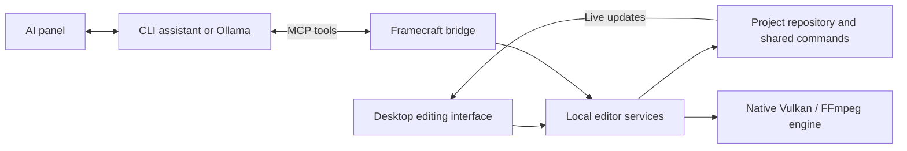

# Framecraft Studio

**A Windows and Linux desktop video editor with AI assistants that work on your real timeline.**

Import footage, arrange multiple tracks, animate titles, build comparisons, mix audio, and export your edit. Use the visual tools yourself or ask an assistant to inspect footage, make cuts, create reusable assets, and review the result through MCP.


## Download and install

Get the desktop packages from [GitHub Releases](https://github.com/Stalkerino/FrameCraft/releases):

| Platform | Download | Install |
| --- | --- | --- |
| Windows 10/11 x64 | `Framecraft_…_x64-setup.exe` | Run the installer, then launch Framecraft from Start. |
| Linux x64 | `Framecraft_…_amd64.AppImage` | Make the file executable and open it. |
| Debian / Ubuntu x64 | `Framecraft_…_amd64.deb` | Install with your package manager. |

Choose an installer asset, not GitHub’s source-code ZIP. Packages include Node, the local editor backend, native media libraries, and built-in assets. Windows packages include the WebView2 offline installer. You do not need Node, Rust, or an external browser to open Framecraft. Linux packages target Ubuntu 22.04 and compatible newer glibc distributions; GPU features require suitable drivers.

Only successful release builds publish installers. If a release has no installer assets, the packages are not ready yet. [Installation and troubleshooting](docs/installation.md).

## Editing tools

- **Timeline:** multiple video, image, text, and audio tracks; split, trim, move, duplicate, copy/paste, drag selection, linked range edits, undo/redo, sequences, and nested sequences.
- **Composition:** position, scale, rotation, opacity, crop, masks, keyframes, easing curves, speed changes, ramps, and freeze holds.
- **Assets:** reusable animated titles, backgrounds, annotations, comparison reveals, transitions, and procedural sound effects. Save variations and share recipes.
- **Color:** clip and sequence grading, LUTs, and scopes.
- **Audio:** fades, gain automation, pan, track and sequence mixing, EQ, compression, reverb, ducking, normalization, and limiting.
- **Assistance:** source-frame inspection, Automatic Cuts, transcription, word-based edits, captions, and AI-assisted sound placement.
- **Projects:** named projects, autosave, copies, backups, project media storage, and a persistent asset library.
- **Output:** custom destination, resolution, frame rate, codec, quality, bitrate, and audio settings; editable timeline XML for handoff to other software.

[Feature and MCP reference](docs/feature-overview.md) · [Timeline handoff](docs/timeline-export.md)

## From footage to export

1. Create or open a project using the project-name menu.
2. Import media. Originals are copied into project storage; background preparation keeps editing available.
3. Match project settings to your source, add clips to tracks, and choose a preview quality suited to your machine.
4. Cut and arrange footage, add titles or saved assets, and adjust color and audio.
5. Optionally ask your assistant to edit the same timeline. Changes share the editor’s undo history.
6. Choose export settings and a destination. The default destination is the project’s `exported` folder.

Preview quality and export quality are separate. Exports use original media, not the reduced-quality editing proxies.

## Native GPU rendering

The Tauri desktop app integrates a Vulkan preview and export engine. Supported scenes keep video decoding, composition, and effects on the GPU. Export settings show a processing plan and explain unsupported combinations before rendering. AMD and NVIDIA are supported targets on Windows and Linux; available decode and encode paths depend on your hardware and drivers.

The native engine handles supported titles, saved recipes, transforms, masks, transitions, and grading. The optional compatible renderer remains available for scenes outside native coverage; it can download its rendering runtime on demand. Audio processing, demuxing, and preparation still involve CPU work. GPU support does not mean every operation is CPU-free.

[GPU pipeline, supported features, and hardware validation](docs/gpu-rendering.md)

## Your choice of AI assistant

Open the AI panel’s settings, choose a provider, configure it, then start the conversation. Manual editing does not require an AI provider.

| Provider | Connection |
| --- | --- |
| Codex | Your installed Codex CLI and its authentication; no separate OpenAI API key required by Framecraft. |
| Claude Code | Installed CLI through its ACP adapter. |
| Gemini CLI / OpenCode | Installed CLI with ACP support. |
| Custom CLI | User-configured executable and arguments supporting ACP over stdio. |
| Ollama | Your local or LAN server URL and a tool-capable model; vision support enables frame inspection. |

The chat displays replies, tool calls, approvals, and the model/mode controls supplied by the provider. Auto-allow is optional. Local models vary in their ability to follow editing instructions and use tools. [Ollama setup](docs/ollama.md).


### How MCP connects

Framecraft launches the configured assistant or connects to your Ollama server. The assistant uses the Framecraft MCP bridge to read the project, inspect frames, create assets, and submit validated editing commands. Those commands reach the same services as manual edits.



The local backend belongs to the desktop application. MCP never needs to overwrite the live project file. The bridge also supports external assistant sessions; see the [MCP reference](docs/feature-overview.md#mcp-tools).

### Reusable assets, in the same conversation

Ask the assistant to create an animation or transition, save it to the library, and place it on the timeline in one conversation. Recipes expose editable parameters; timeline instances retain their saved version so later library edits do not silently change existing projects.

> “Place Before and After on simultaneous video tracks. Reveal After from left to right over four seconds with a white divider, add labels and a whoosh, then inspect the midpoint.”


[Asset recipes](docs/asset-studio.md) · [Comparison examples](docs/asset-pack.md) · [Sound library](docs/sound-library.md)

## Build the desktop app from source

Install Node.js 22+ with npm, Rust, and the [Tauri platform prerequisites](https://v2.tauri.app/start/prerequisites/). Windows requires MSVC C++ tools and a Windows SDK; Linux requires GTK 3 / WebKitGTK 4.1 development packages. Build on the destination OS.

```sh
git clone https://github.com/Stalkerino/FrameCraft.git
cd FrameCraft
npm run desktop:build
npm run desktop:start
```

Alternatively use `Build-Windows.cmd` / `Start-Windows.cmd`, or `sh Build-Linux.sh` / `sh Start-Linux.sh`. The builder prepares locked dependencies and the pinned native SDK. Close Framecraft before rebuilding. Source builds retain their checkout, `node_modules`, and `.runtime`; they are not standalone installers.

Use `npm run desktop:dev` for desktop development after setup. Use `npm run desktop:release` to build standalone packages for your current OS. GitHub Actions builds Windows and Linux installers for version tags; see [release instructions](docs/installation.md#github-ci-releases).

The architecture keeps shared domain commands separate from repositories, reusable services, and HTTP/MCP adapters. The Tauri shell embeds the existing React interface, organized with atomic components and SCSS 7–1. Rendering and editing use shared frame-based timing and effect definitions.

[Architecture](docs/architecture.md) · [Contributing](CONTRIBUTING.md)

## Project status

Framecraft is under active development. Native rendering coverage and performance vary by scene and hardware; consult the processing plan rather than assuming every codec or effect combination is supported. Motion tracking is not implemented. Automatic Cuts use sampled frames and may miss brief events. Editable XML transfers timing and supported properties; other editors may need effects rebuilt.

Projects and settings live outside installed application files. Back up your projects and custom library. AI services follow the selected provider’s data handling; choosing a remote CLI provider is different from using a local Ollama model. Model downloads may require internet access on first use.

## Licensing

Framecraft’s original code is **GPL-3.0-or-later**, with an additional permission for integration with Remotion. See [licensing terms](LICENSING.md), the full [GNU GPL](LICENSE), and [third-party notices](THIRD_PARTY_NOTICES.md). FFmpeg, Remotion, and other bundled components retain their respective licenses.
