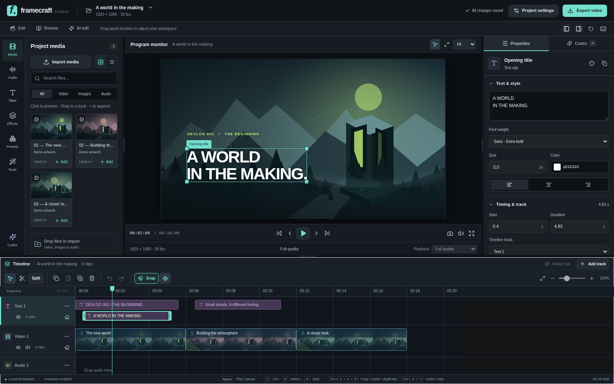
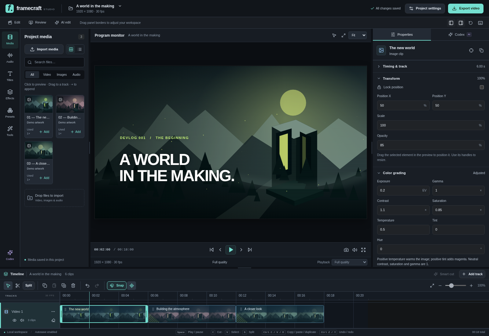
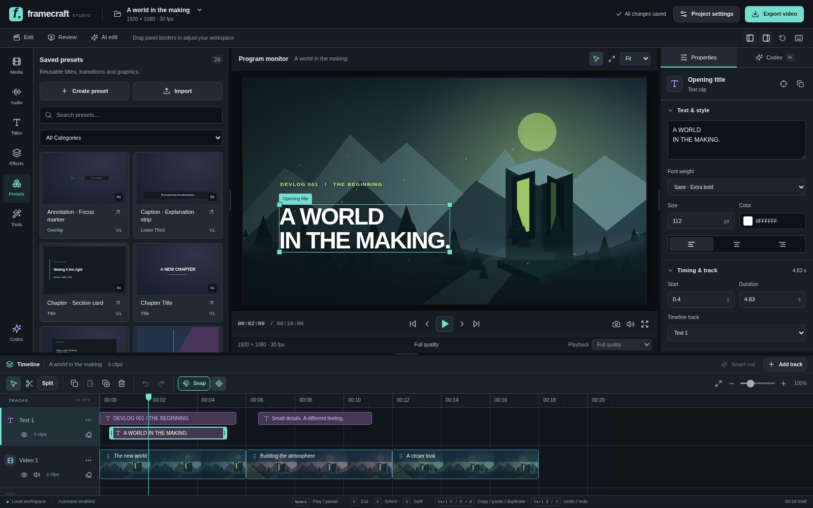
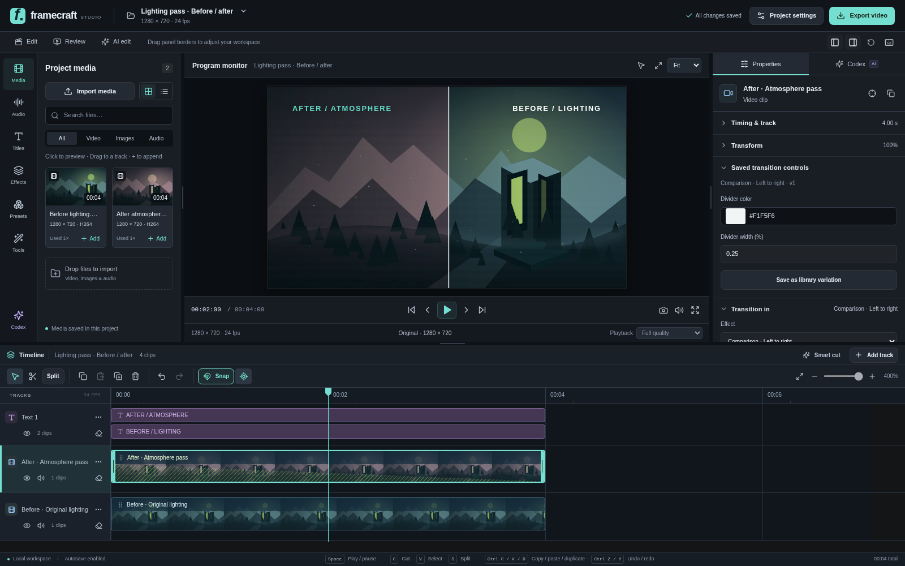
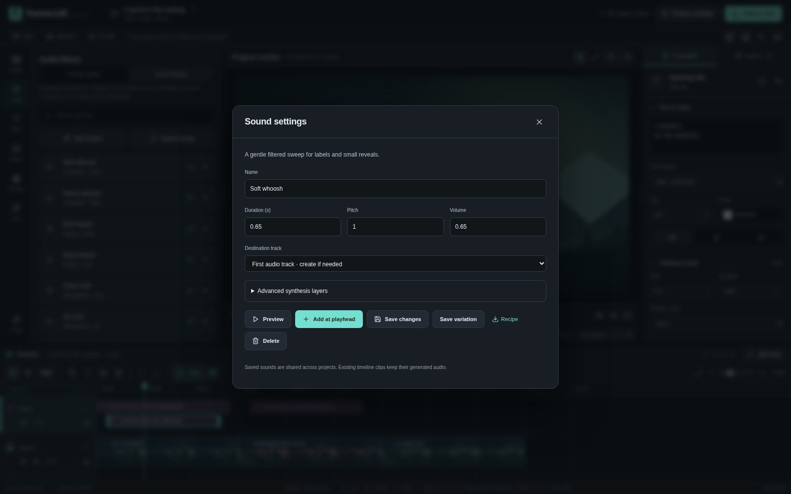
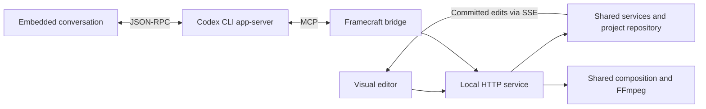
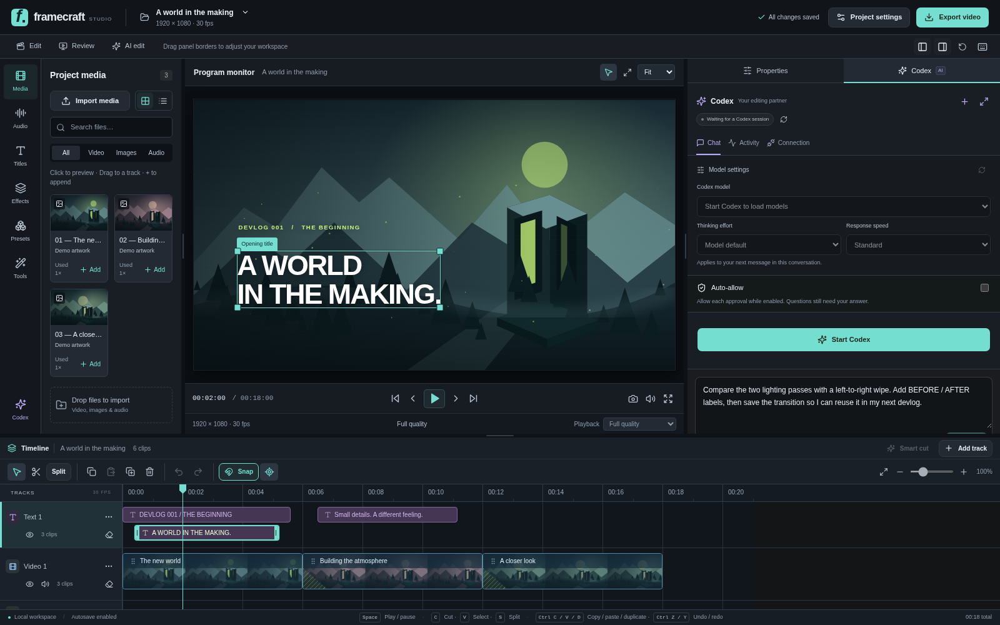

# Framecraft Studio

**Edit your footage visually. Let Codex work on the same timeline.**

Framecraft is a local video editor for devlogs, gameplay breakdowns, tutorials, and before/after presentations. Import footage, cut and arrange multiple tracks, add animated graphics, and export through FFmpeg. The embedded Codex CLI can inspect frames, make edits, create reusable assets, and review the result through MCP.



## What you can do

| Editing | Assisted workflows |
| --- | --- |
| Multiple video, graphics, and audio tracks | Ask Codex to cut, reorder, move, and layer clips |
| Coordinated range cuts across tracks | Remove sections or assemble/repeat moments while related tracks move together |
| Audio fades, gain automation, EQ, compression, and room reverb | Duck music beneath foreground tracks and apply reusable sound effects |
| Split, trim, copy, paste, duplicate, and undo/redo | Inspect source images and composited frames through MCP |
| Drag and resize elements directly in the preview | Review gameplay with no narration and propose an edit |
| Titles, annotations, focus zooms, and transitions | Generate editable animations and save them for reuse |
| Clip and project color adjustments | Grade selected clips, tracks or timeline sections through MCP |
| Crop, masks, opacity and transform keyframes | Animate placement with easing or custom Bézier curves |
| Constant speed, ramps and freeze holds | Retime the same source through MCP or Ctrl-drag its right edge |
| Saved sound effects with real audio preview | Generate whooshes, impacts and interface cues locally, then let Codex place them |
| Resizable Edit, Review, and AI edit layouts | Transcribe speech, cut by words, and generate captions |
| Named projects, autosave, and shared preset library | Type or dictate into the existing Codex conversation |
| Custom resolution, fps, codec, quality, and bitrate | Export with detected AMD/NVIDIA hardware or CPU |
| Editable timeline export | Download Premiere-compatible XML, a media/effect report and the full project backup |

See the [feature and MCP tool reference](docs/feature-overview.md) for the full list and current boundaries.

## Run locally

Install **Node.js 22+** and **FFmpeg with ffprobe** on your PATH. A Chrome/Chromium executable is needed for rendering; set `CHROME_PATH` if necessary, or let Remotion download its compatible browser on the first render.

Clone the repository, then run the same commands on **Windows or Linux**:

```sh
git clone https://github.com/Stalkerino/FrameCraft.git
cd FrameCraft
npm ci
npm run doctor
npm run build
npm start
```

Open **http://127.0.0.1:4318**. For frontend development, use `npm run dev` and open **http://127.0.0.1:5173** instead.

The editor works without Codex. To use the embedded agent, install Codex CLI, sign in with `codex login`, then open **AI edit → Start Codex**. Framecraft configures its MCP bridge for that process automatically. Your installed CLI handles model access and authentication; Framecraft requires no separate OpenAI API key.

[Windows setup, Linux setup, environment variables, GPU drivers, and troubleshooting →](docs/getting-started.md)

## One project, one editing workflow

1. Create a project from the project-name menu, then import your video, images, or audio.
2. Use **Match source** in project settings to retain your footage's resolution and recorded frame rate.
3. Preview media in the library, add clips to tracks, and cut or rearrange them on the timeline.
4. Add titles or saved presets; use the canvas and grouped Properties controls for placement.
5. Ask Codex to make further edits and inspect frames. Its timeline changes share your undo history.
6. Review playback, choose export settings, and render a frozen project snapshot while you continue editing.

To continue editing elsewhere, use **Export timeline → Prepare XML export → Download XML** beside the video export button. See [timeline handoff](docs/timeline-export.md) for media relinking and effects that need rebuilding.

Originals are copied into project media storage. Full-quality playback uses supported originals or an on-demand, full-resolution compatibility copy; **Performance** deliberately selects a smaller playback copy. Export always reads original media. Project and export resolution are separate settings.

Exports support H.264, H.265, AV1, VP8/VP9, and ProRes with compatible containers and audio settings. AMD uses VA-API on Linux and AMF on Windows; NVIDIA uses NVENC. Availability depends on the GPU, driver, and FFmpeg build. GPU compression, sequential source decoding where eligible, reused artwork frames, and bounded worker/buffer settings keep the export pipeline practical without promising real-time rendering on every machine.

Adjust individual clips or finish the whole timeline with exposure, contrast, saturation, temperature, tint, gamma and hue; visual elements also have an opacity control. Codex can apply these adjustments through the same editing tools—see [color grading](docs/color-grading.md).



## Reusable assets and comparisons

The persistent preset library includes **24 starters**, with 17 comparison, presentation, and devlog recipes alongside the original titles, backgrounds, and transitions. Customize text, colors, timing, and exposed controls, save variations, or share recipes as JSON. Timeline instances embed their preset version, so a later library edit does not change an existing video.



A comparison wipe can reveal one playing video over another, with an animated divider. Put the recordings on **separate, simultaneous video tracks**; a saved transition provides the reveal and divider, while clip placement and synchronization remain timeline edits.

> “Place Before and After on separate video tracks, synchronized to the same action. Reveal After from left to right over four seconds with a white divider, add labels, and inspect the midpoint.”



[Asset pack and example prompts](docs/asset-pack.md) · [Authoring portable recipes](docs/asset-studio.md)

**Audio → Sound library** adds 12 reusable procedural sound effects with duration, pitch and volume controls. Preview, place, customize and share recipes, or ask the same Codex agent to create and position effects at the right timeline frames. Generated WAVs are copied into project media. See the [sound library guide](docs/sound-library.md).



## How Codex connects

The embedded conversation launches the **installed Codex CLI's app-server** and communicates over stdio. That process connects to `scripts/mcp.mjs`, which exposes Framecraft's editing, media, asset, analysis, and rendering tools. The bridge sends commands to the running editor service; it never rewrites the live project file directly.



Real tool calls appear in the conversation and Activity view, including automatically approved calls. Model, reasoning, and available speed controls are read from the spawned CLI. Approval prompts remain actionable; optional Auto-allow accepts supported requests while enabled. Dictation creates a reviewable prompt draft.



The screenshot shows the panel before starting a session, with an unsent example prompt.

To connect an external terminal session instead, keep Framecraft running and register the bridge once:

```sh
codex mcp add framecraft -- node "/absolute/path/to/Framecraft/scripts/mcp.mjs"
codex
```

On Windows, use a path such as `C:\Projects\Framecraft\scripts\mcp.mjs`. Registration alone does not start a session or edit a project. See [connection instructions](docs/getting-started.md#connect-an-external-codex-cli) and the [MCP reference](docs/feature-overview.md#mcp-tools).

## Built to extend

- **Shared domain:** typed schemas and frame-based commands, with revision checks and atomic transactions.
- **Reusable services:** project storage, media import, preview, rendering, analysis, and Codex process management behind HTTP/MCP adapters.
- **Atomic interface:** atoms → molecules → organisms → templates → pages; typed clients, hooks, and Zustand stores.
- **SCSS 7–1:** abstracts, base, components, layout, pages, themes, and vendors through one `main.scss` entry point.
- **Shared rendering:** the same Remotion composition and deterministic animation rules drive preview, inspections, and export.
- **Cross-platform processes:** Node APIs and executable argument arrays for Windows and Linux. CI covers both platforms; local runtime validation has been on Linux.

[Architecture](docs/architecture.md) · [Contributing](CONTRIBUTING.md) · [Custom effects](docs/custom-effects.md)

## Current scope

Framecraft is an early local editor. [Crop, masks and transform keyframes](docs/advanced-editing.md) support manual composition and animation; [speed ramps](docs/speed-ramping.md) create reusable retimed media with progress and cancellation. Motion tracking and desktop installers are not included. Basic [color grading](docs/color-grading.md) supports exposure, contrast, saturation, temperature, tint, gamma and hue; advanced LUT/scopes/HDR workflows are not available. Comparison presets decorate/reveal clips; they do not automatically synchronize recordings or create a complete timeline layout.

Codex can remove or assemble timeline ranges across all tracks or an explicit subset, with a preview and one undo step. Persistent linked-clip groups are not available. Audio supports fades, gain automation, clip-range ducking, and rendered EQ/compression/room-reverb copies; this is not a live plugin or sidechain rack. See [audio editing](docs/audio-editing.md), [whole-sequence editing](docs/timeline-editing.md), and [multi-track capabilities](docs/feature-overview.md#editing-an-existing-multi-track-timeline).

Gameplay review uses sampled source frames and can miss brief events. Speech search searches transcripts, not visual content. Local transcription downloads models on first use; Codex prompts and inspected images use the configured Codex service and its normal usage allowance.

The service is designed for a trusted local workspace, with one active project shared across connected browsers. Back up the workspace and any separately configured preset library. Media, exports, caches, and local session data are excluded from this source repository. See [project management](docs/projects.md) for storage details.

No project license has been selected yet; dependencies retain their own license terms.
