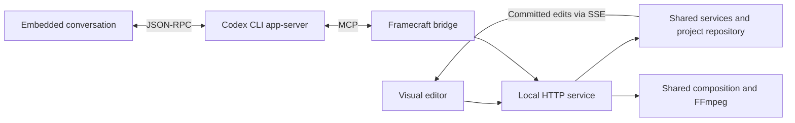

# Framecraft Studio

**Edit your footage visually. Let Codex work on the same timeline.**

Framecraft is a local video editor for devlogs, gameplay breakdowns, tutorials, and before/after presentations. Import footage, cut and arrange multiple tracks, add animated graphics, and export through FFmpeg. The embedded Codex CLI can inspect frames, make edits, create reusable assets, and review the result through MCP.


## What you can do

| Editing | Assisted workflows |
| --- | --- |
| Multiple video, graphics, and audio tracks | Ask Codex to cut, reorder, move, and layer clips |
| Coordinated range cuts across tracks | Remove sections or assemble/repeat moments while related tracks move together |
| Audio fades, gain automation, EQ, compression, and room reverb | Duck music beneath foreground tracks and apply reusable sound effects |
| Split, trim, copy, paste, duplicate, and undo/redo | Inspect source images and composited frames through MCP |
| Drag and resize elements directly in the preview | Review gameplay with no narration and propose an edit |
| Titles, annotations, focus zooms, and transitions | Generate editable animations and save them for reuse |
| Clip and project color adjustments | Grade selected clips, tracks or timeline sections through MCP |
| Crop, masks, opacity and transform keyframes | Animate placement with easing or custom Bézier curves |
| Constant speed, ramps and freeze holds | Retime the same source through MCP or Ctrl-drag its right edge |
| Saved sound effects with real audio preview | Generate whooshes, impacts and interface cues locally, then let Codex place them |
| Resizable Edit, Review, and AI edit layouts | Transcribe speech, cut by words, and generate captions |
| Named projects, autosave, and shared preset library | Type or dictate into the existing Codex conversation |
| Custom resolution, fps, codec, quality, and bitrate | Export with detected AMD/NVIDIA hardware or CPU |
| Editable timeline export | Download Premiere-compatible XML, a media/effect report and the full project backup |

See the [feature and MCP tool reference](docs/feature-overview.md) for the full list and current boundaries.

## Run locally

**Desktop downloads:** open [GitHub Releases](https://github.com/Stalkerino/FrameCraft/releases) and download the Windows `-setup.exe`, Linux `.AppImage`, or `.deb`. Release packages bundle Node, the editor backend, native media libraries and built-in assets. No repository checkout, Node, Rust or Chrome installation is needed to open the desktop editor. [Installation and release builds →](docs/installation.md)

### Optional web mode / backend development

Install **Node.js 22+** and **FFmpeg with ffprobe** on your PATH. A Chrome/Chromium executable is needed for rendering; set `CHROME_PATH` if necessary, or let Remotion download its compatible browser on the first render.

Clone the repository, then run the same commands on **Windows or Linux**:

```sh
git clone https://github.com/Stalkerino/FrameCraft.git
cd FrameCraft
npm ci
npm run doctor
npm run build
npm start
```

Open **http://127.0.0.1:4318**. For frontend development, use `npm run dev` and open **http://127.0.0.1:5173** instead.

### Desktop development app — native GPU preview

**Build and try on Windows/Linux x64:** install Node.js 22+ with npm, Rust, and the [Tauri build prerequisites](https://v2.tauri.app/start/prerequisites/) once. Windows needs the MSVC Rust toolchain, Visual Studio C++ Build Tools/Windows SDK and WebView2; Linux needs a C/C++ toolchain, pkg-config, GTK 3 and WebKitGTK 4.1 development packages.

Run **Build-Windows.cmd** or **`sh Build-Linux.sh`**. Both call the same script, also available as **`npm run desktop:build`**. It installs locked npm dependencies when changed, downloads the pinned media SDK/headers, builds the UI and optimized native executable, and prints its location. Build separately on each OS; this does not cross-compile. It uses one compiler job and disables release LTO by default to limit build pressure. It never runs GPU probes or tests.

Then use **Start-Windows.cmd** (or **Start-Desktop-Windows.cmd**), **`sh Start-Linux.sh`** (or **`sh Start-Desktop-Linux.sh`**), or **`npm run desktop:start`**. Keep the checkout, `node_modules` and `.runtime`: these are local test builds, not standalone installers. `npm run desktop:build -- --launch` starts after building; `--debug` builds faster without release optimization; `--check` only checks build prerequisites. Build output is recorded in `.runtime/desktop-build.json`, with compiler output in `.runtime/desktop-build.log`. Close the editor before rebuilding. Native build prerequisites and graphics drivers are not installed automatically.

The Tauri 2 desktop app reuses the React/SCSS editor and the same Node backend, MCP tools, Codex/Ollama integration and asset library. Install Rust and the [Tauri platform prerequisites](https://v2.tauri.app/start/prerequisites/) (Windows: MSVC build tools and WebView2; Linux: GTK 3 and WebKitGTK 4.1 development libraries), run `npm run desktop:setup` once for the pinned FFmpeg media libraries and Vulkan headers, then `npm run desktop:dev`. It starts the local backend, or attaches to an existing server for this checkout and data directory. Closing the app stops only the backend it started.

Open **Desktop · native monitor → Use native GPU preview** and select AMD or NVIDIA. Original video is decoded with Vulkan Video, composed with the export planner/shaders (including native-supported text, presets, grading, transforms and masks), then presented directly from its GPU image. One persistent device and the current scene's decoders are retained during playback; seeks replace the scene when necessary. No video pixels cross JavaScript, and no intermediate video is encoded. Unsupported native scenes fail explicitly. Audio and its existing transport/envelopes still run in the webview; demux, control and font layout use CPU, and still images are prepared once per source.

Use **Use compatible preview** for canvas selection handles and safe-area guides, which are not yet layered above the native surface. Native presentation runs on a worker, keeps one pending frame request, applies export memory admission/graph queue limits, and releases GPU resources before its child window. `npm run desktop:build` produces a source-checkout executable, **not a standalone installer**; Node and the checkout remain required. Windows builds copy the matching media DLLs beside the executable.

The bounded check (`npm run desktop:check -- amd --run --video`, after a debug build) passed Vulkan decoding, composition with a title, cut crossing, backward seek, resize and shutdown at 320×180 on AMD RX 9070 XT/Linux Wayland. This is functional validation, not a long-timeline performance benchmark. Linux X11, NVIDIA/Linux and both Windows GPU vendors have adapters but still require hardware validation.

The editor works without Codex. To use the embedded agent, install Codex CLI, sign in with `codex login`, then open **AI edit → Start Codex**. Framecraft configures its MCP bridge for that process automatically. Your installed CLI handles model access and authentication; Framecraft requires no separate OpenAI API key.

[Windows setup, Linux setup, environment variables, GPU drivers, and troubleshooting →](docs/getting-started.md)

## One project, one editing workflow

1. Create a project from the project-name menu, then import your video, images, or audio.
2. Use **Match source** in project settings to retain your footage's resolution and recorded frame rate.
3. Preview media in the library, add clips to tracks, and cut or rearrange them on the timeline.
4. Add titles or saved presets; use the canvas and grouped Properties controls for placement.
5. Ask Codex to make further edits and inspect frames. Its timeline changes share your undo history.
6. Review playback, choose export settings, and render a frozen project snapshot while you continue editing.

To continue editing elsewhere, use **Export timeline → Prepare XML export → Download XML** beside the video export button. See [timeline handoff](docs/timeline-export.md) for media relinking and effects that need rebuilding.

Originals are copied into project media storage. Full-quality playback uses supported originals or an on-demand, full-resolution compatibility copy; **Performance** deliberately selects a smaller playback copy. Export always reads original media. Project and export resolution are separate settings.

Exports support H.264, H.265, AV1, VP8/VP9, and ProRes with compatible containers and audio settings. AMD uses VA-API on Linux and AMF on Windows; NVIDIA uses NVENC. Availability depends on the GPU, driver, and FFmpeg build. GPU compression, sequential source decoding where eligible, reused artwork frames, and bounded worker/buffer settings keep the export pipeline practical without promising real-time rendering on every machine.

Static crop, placement, scaling and canvas gaps use the native export path. Eligible plain cuts keep their frames on the GPU; complex effects use hardware browser rendering when available. Progress identifies CPU filter work separately from GPU encoding. [GPU pipeline, supported stages and remaining limits →](docs/gpu-rendering.md)

**Experimental native GPU engines:** Export → Render engine offers **Native GPU · cuts & scaling** for full-canvas SDR cuts, and **Native GPU · Vulkan composition** for simultaneous videos/images, static crop/placement/scaling, opacity, color grading and canvas gaps. Both require GPU video processing without CPU/browser fallback and report unsupported effects before export. Fixed images are prepared once on CPU, then reused as GPU textures. The bounded composition/effects checks passed on AMD/Linux RX 9070 XT; broader validation and Windows/NVIDIA checks remain pending. Existing projects keep the compatible renderer and their assets. MCP selects the same engines through `get_render_plan` / `export_video`. See the [requirements and bounded hardware check](docs/gpu-rendering.md).

Adjust individual clips or finish the whole timeline with exposure, contrast, saturation, temperature, tint, gamma and hue; visual elements also have an opacity control. Codex can apply these adjustments through the same editing tools—see [color grading](docs/color-grading.md).


## Reusable assets and comparisons

The persistent preset library includes **24 starters**, with 17 comparison, presentation, and devlog recipes alongside the original titles, backgrounds, and transitions. Customize text, colors, timing, and exposed controls, save variations, or share recipes as JSON. Timeline instances embed their preset version, so a later library edit does not change an existing video.


A comparison wipe can reveal one playing video over another, with an animated divider. Put the recordings on **separate, simultaneous video tracks**; a saved transition provides the reveal and divider, while clip placement and synchronization remain timeline edits.

> “Place Before and After on separate video tracks, synchronized to the same action. Reveal After from left to right over four seconds with a white divider, add labels, and inspect the midpoint.”


[Asset pack and example prompts](docs/asset-pack.md) · [Authoring portable recipes](docs/asset-studio.md)

**Audio → Sound library** adds 12 reusable procedural sound effects with duration, pitch and volume controls. Preview, place, customize and share recipes, or ask the same Codex agent to create and position effects at the right timeline frames. Generated WAVs are copied into project media. See the [sound library guide](docs/sound-library.md).


## How Codex connects

The embedded conversation launches the **installed Codex CLI's app-server** and communicates over stdio. That process connects to `scripts/mcp.mjs`, which exposes Framecraft's editing, media, asset, analysis, and rendering tools. The bridge sends commands to the running editor service; it never rewrites the live project file directly.



Real tool calls appear in the conversation and Activity view, including automatically approved calls. Model, reasoning, and available speed controls are read from the spawned CLI. Approval prompts remain actionable; optional Auto-allow accepts supported requests while enabled. Dictation creates a reviewable prompt draft.


The screenshot shows the panel before starting a session, with an unsent example prompt.

To connect an external terminal session instead, keep Framecraft running and register the bridge once:

```sh
codex mcp add framecraft -- node "/absolute/path/to/Framecraft/scripts/mcp.mjs"
codex
```

On Windows, use a path such as `C:\Projects\Framecraft\scripts\mcp.mjs`. Registration alone does not start a session or edit a project. See [connection instructions](docs/getting-started.md#connect-an-external-codex-cli) and the [MCP reference](docs/feature-overview.md#mcp-tools).

## Built to extend

- **Shared domain:** typed schemas and frame-based commands, with revision checks and atomic transactions.
- **Reusable services:** project storage, media import, preview, rendering, analysis, and Codex process management behind HTTP/MCP adapters.
- **Atomic interface:** atoms → molecules → organisms → templates → pages; typed clients, hooks, and Zustand stores.
- **SCSS 7–1:** abstracts, base, components, layout, pages, themes, and vendors through one `main.scss` entry point.
- **Shared rendering:** the Remotion composition drives preview, inspections and compatible export. Native GPU exports share project timing, placement and audio-envelope semantics. Static video composition is implemented experimentally; GPU assets, remaining effects and native preview are subsequent increments.
- **Cross-platform processes:** Node APIs and executable argument arrays for Windows and Linux. CI covers both platforms; local runtime validation has been on Linux.

[Architecture](docs/architecture.md) · [Contributing](CONTRIBUTING.md) · [Custom effects](docs/custom-effects.md)

## Current scope

Framecraft is an early local editor. [Crop, masks and transform keyframes](docs/advanced-editing.md) support manual composition and animation; [speed ramps](docs/speed-ramping.md) create reusable retimed media with progress and cancellation. Motion tracking and desktop installers are not included. Basic [color grading](docs/color-grading.md) supports exposure, contrast, saturation, temperature, tint, gamma and hue; advanced LUT/scopes/HDR workflows are not available. Comparison presets decorate/reveal clips; they do not automatically synchronize recordings or create a complete timeline layout.

Codex can remove or assemble timeline ranges across all tracks or an explicit subset, with a preview and one undo step. Persistent linked-clip groups are not available. Audio supports fades, gain automation, clip-range ducking, and rendered EQ/compression/room-reverb copies; this is not a live plugin or sidechain rack. See [audio editing](docs/audio-editing.md), [whole-sequence editing](docs/timeline-editing.md), and [multi-track capabilities](docs/feature-overview.md#editing-an-existing-multi-track-timeline).

Automatic Cuts review uses sampled source frames and can miss brief events. Speech search searches transcripts, not visual content. Local transcription downloads models on first use; Codex prompts and inspected images use the configured Codex service and its normal usage allowance.

The service is designed for a trusted local workspace, with one active project shared across connected browsers. Back up the workspace and any separately configured preset library. Media, exports, caches, and local session data are excluded from this source repository. See [project management](docs/projects.md) for storage details.

No project license has been selected yet; dependencies retain their own license terms.

### Other CLI assistants

In the AI panel, open **Settings → AI provider** to choose **Claude Code (ACP adapter)**, **Gemini CLI**, **OpenCode**, or a **custom ACP CLI**. Install and sign in to the chosen agent first; each preset includes its setup instructions. Configure an executable path, argument array and working folder, save, then press **Start** in Chat. Windows npm shims for the presets are resolved to their package entry point without a shell.

The same chat shows streamed replies, tool activity, approvals and the model/mode options exposed by the agent. Framecraft passes its complete MCP bridge at session creation, including editing and reusable asset tools. Native file/command operations remain the CLI’s responsibility. Custom agents must support **ACP over stdio**, not only MCP. Claude requires the [Claude ACP adapter](https://github.com/agentclientprotocol/claude-agent-acp); [Gemini](https://geminicli.com/docs/cli/acp-mode/) and [OpenCode](https://opencode.ai/docs/acp/) have native ACP modes. Browser reloads preserve the running chat; a Framecraft restart starts a new chat for these providers. Codex and Ollama retain their existing integrations.

### Optional local AI with Ollama

Use the existing AI panel with an Ollama server on your computer or LAN: select **AI provider → Ollama**, save its URL, load models and start the assistant. Tool calls use the real Framecraft MCP bridge, with approvals, live edits and undo. Vision-capable models can inspect frames. Codex CLI remains available as a separate provider. [Ollama setup and limitations →](docs/ollama.md)

Ollama has compact editing commands, persistent timestamped visual observations, structured project/report results and a **16 GB context preset** with actual GPU allocation shown in the panel. [Pipeline audit and real-model results →](docs/ollama-pipeline.md)

Optional **Workspace access** lets Ollama read/edit code and execute commands on the Framecraft host in the same chat. File writes and commands follow approvals and Auto-allow. Command mode uses your host account permissions and is not sandboxed; file changes are separate from timeline Undo.
