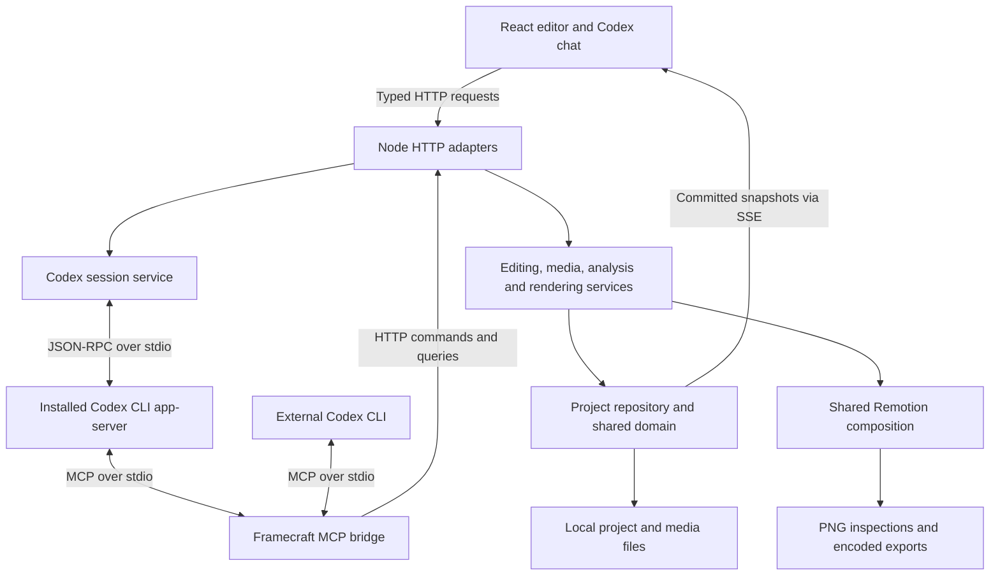

# Framecraft — feature and technical overview

Framecraft is a local, AI-assisted video editor for developer logs, gameplay, tutorials, and before/after presentations. You can edit visually or ask the real Codex CLI agent to manipulate the same timeline. Codex can render individual frames, inspect the resulting images, and refine its edits. See [getting started](getting-started.md) for installation and the [README](../README.md) for screenshots.

## Video editing

- **Workspace:** resizable media and inspector panels and timeline; Edit, Review and AI edit layouts; grouped clip properties; project menu and visible export/settings controls. Layout preferences persist in the browser.
- **Media library:** import video, images, and audio by file picker, drag and drop, or an agent-accessible absolute local path. Originals are copied into project media storage. Filter by media type, use grid/list view, inspect a source without inserting it, then append or place it at the playhead on a chosen track.
- **Playback quality:** full quality uses browser-supported originals or an on-demand full-resolution compatibility copy. Performance explicitly chooses a smaller playback copy. Progress and Stop/Retry controls describe preparation; the monitor shows the selected source dimensions and Fit/50%/100% display zoom. Compatibility copies are compressed. Exports read originals regardless of playback mode.
- **Timeline:** add multiple video, text/graphics and audio tracks. Rename, reorder, mute, hide, clear and remove empty tracks; higher tracks appear in front in preview and export. Move clips between compatible tracks by dragging or through Properties. Overlapping clips appear in stacked lanes. Move, trim, split, copy/paste, duplicate, delete, and snap clips. Adjust source-in points and volume. Undo/redo, a clip context menu, follow-playhead and keyboard shortcuts support editing. Clearing one track preserves other tracks and imported media.
- **Direct canvas editing:** select visible text, graphics, images, video, captions, or annotations in the preview; drag to reposition and use corner handles to scale. Arrow keys nudge a selected element, with Shift for larger steps. **Lock position** preserves X/Y while allowing content, size and timeline edits; slight pointer movements on clicks are ignored. A completed drag creates one undo step; a conflicting agent edit cancels the pending drag.
- **Text:** editable content, font size, weight, color, alignment, position, scale, and entrance animation. Included animations are rise and typewriter.
- **Transitions:** dissolve, push, diagonal wipe, pixel reveal and saved custom transition recipes, with configurable duration. Advanced effects can also extend the shared TypeScript renderer.
- **Asset Studio:** a persistent library of animated titles, lower thirds, backgrounds, overlays, intros/outros and custom transitions. Use the existing right-hand Codex chat to generate assets, place them and edit the timeline in one prompt through MCP. Customize exposed controls, save variations, preview animations, drag onto the timeline and import/export portable packages. Existing clips embed their preset version. See the [asset guide](asset-studio.md).
- **Sound library:** 12 locally synthesized effects—whooshes, impacts, risers, clicks, notifications and transition cues—with actual audio preview, duration/pitch/volume controls, editable layer recipes, saved variations and portable JSON import/download. MCP can create reusable recipes and place generated WAVs at exact timeline frames through the same Codex chat. Project audio imports remain available separately. See the [sound guide](sound-library.md).
- **Comparison/devlog pack:** saved parameterized graphics and reveals for comparisons, presentation framing and common devlog elements. For a live comparison wipe, place both videos simultaneously on separate tracks and apply the reveal to the upper one. The recipe supplies the reveal/divider; synchronization and track arrangement remain normal timeline edits. Static comparison labels also require placing the video clips. See the [catalog and prompts](asset-pack.md).
- **Focus tools:** arrows, frames, circles, and animated focus zooms with adjustable position, size, color, rotation, magnification, and timing.
- **Audio:** separate audio clips, video sound, source trimming, clip volume, and project master volume. Preview mute controls monitoring independently.
- **Project settings:** custom canvas size, landscape/portrait/square presets through 8K, fractional or integer frame rates from 1 to 120 fps, background color, and master volume. Match source copies dimensions and recorded source fps; older imports without fps retain the chosen rate. Changing fps converts clip and animation timing onto the new frame grid, preserving elapsed timing within frame rounding.
- **Projects and persistence:** New project with canvas settings, searchable Open project, Save as an independent copy, and rename. Each project keeps its timeline, media list, settings and 50 undo states across switches/restarts. Automatic local saving and revision checks are shared by UI and MCP. One project is active across connected browsers at a time. See [Managing projects](projects.md).

## Local assisted editing

### Editing an existing multi-track timeline

MCP editing commands address every clip and track in the current project. `edit_timeline_ranges` removes intervals and closes time, or assembles ordered intervals from the existing timeline, including intentional repeats. It defaults to all tracks so video, audio, labels, captions and graphics move together. An explicit track selection limits the operation; omitted tracks remain fixed. Preview with `apply: false`, then commit with `apply: true` as one undoable edit. Ordinary `edit_project` commands remain available for individual clips. Clips do not have persistent group/link relationships.

The gameplay review tools analyze individual source assets. Codex can inspect several sources and render composited timeline frames to plan a full edit, but there is no dedicated whole-timeline gameplay analysis engine. Transcript word cuts have a specific all-track ripple operation; applying a gameplay proposal to one track leaves other tracks at their existing times. Use range editing to coordinate changes across an existing sequence. See [range semantics, examples and prompts](timeline-editing.md).

Audio supports trimming, splitting, placing imported music/sound effects, mixing overlapping clips, static clip/master volume, and track mute. Smooth volume automation, fades/crossfades, ducking, EQ, compression, and reverb are not implemented as editable audio effects.

Example prompt:

> Shorten this whole timeline to the strongest moments. Keep the two video tracks synchronized, move the corresponding labels and audio with each section, and place the imported impact sound at the main transition. Preserve unrelated clips and inspect the resulting cuts.

### Analysis and proposals

- **Gameplay without narration:** local visual-change, brightness and low-motion scanning; source-frame grids and detailed sequence/single-frame inspection through MCP. The existing Codex chat interprets the actual imagery and saves proposals with source timestamps, reasons, confidence and inspected evidence references. Preview, select/reorder and apply shots to a video track in one undo step. Cached maps and project-specific proposals persist. This is sampled visual review and can miss brief events; local signals alone do not identify meaningful gameplay. See [Gameplay cuts](gameplay-cuts.md).

- **Speech transcription:** local Whisper recognition with word timestamps; automatic language detection and explicit French/English choices. Correct individual words before editing or generating captions.
- **Transcript cuts:** select words, review the affected time ranges, then remove them. The cut ripples across every track in one undoable transaction.
- **Captions:** generate clean, word-highlighted, or boxed subtitles; adjust their styling, convert to plain text, and download SRT/VTT. Captions are independent layers and should be regenerated after manually changing their source clip timing.
- **Semantic speech search:** search transcribed passages by meaning using multilingual embeddings, preview a result, and append its source excerpt. Untranscribed assets use explicitly labelled filename matching. Search does not analyze the imagery.
- **First-cut proposals:** choose sources, a topic, and a target length; review, preview, reorder, or remove proposed shots before appending or replacing the timeline. Optionally add an opening title. This assembles source passages; it does not invent footage or a narrative.
- **Analysis jobs:** progress reporting and cancellation. Whisper and multilingual MiniLM run locally through Transformers.js workers; models download on first use and are cached. No additional inference API key is required.

## Codex interaction

- **Embedded chat:** start a genuine Codex CLI session from the editor, send prompts, receive streamed Markdown replies, and inspect real tool calls, command output, and file changes. Tool calls appear in the conversation even when approved automatically, as well as in Activity.
- **Model controls:** choose from the spawned CLI's available models, supported reasoning efforts and speed/service tiers. Settings apply to that CLI thread while idle, using its authentication and model access; Framecraft requires no separate OpenAI API key.
- **Session controls:** interrupt a response, start a new chat, reconnect after a browser refresh, and resume the saved Codex thread after restarting the editor service.
- **Approvals:** allow or decline actual Codex requests and answer clarification forms. An optional **Auto-allow** switch accepts supported approvals while enabled, including pending requests. Questions requiring an answer stay manual; permission grants are limited to the current turn. Server restart resets the switch.
- **Voice input:** dictate in French or English into an editable prompt draft. Local mode records with `getUserMedia`/`MediaRecorder` and uses the local Whisper worker, including in Firefox. An optional browser speech-recognition mode is also available where supported. Dictation never sends the prompt automatically; there is no spoken response playback.
- **Connection status:** shows actual initialized MCP clients and activity. Registering a server alone does not create an active connection or trigger an edit.

Microphone access requires localhost or HTTPS; plain HTTP on a LAN IP does not qualify. Local dictation stays on the editor host. Browser recognition may use an online speech service. Codex requests and inspected images follow the user's Codex service configuration. See [MDN's microphone API documentation](https://developer.mozilla.org/en-US/docs/Web/API/MediaDevices/getUserMedia).

## Export and inspection

- Custom output dimensions and fps independent of project settings, with fit, fill/crop, or stretch handling and a composition preview.
- H.264 and H.265 MP4, VP8/VP9 WebM, AV1 MP4, Apple ProRes MOV, and H.264 MKV.
- Constant quality (CRF) or target video bitrate for applicable codecs; H.264 encoding speed and ProRes profiles.
- Optional audio, compatible AAC/Opus/PCM choices, audio bitrate where applicable, and 44.1/48 kHz sample rates.
- Whole-timeline or time-range export; optionally remember settings per project.
- Match source, quality presets, dimension/fps hints and recommended bitrate help avoid unintended downscaling. New settings default to quality 16; saved user choices remain unchanged. CPU CRF and GPU CQ/QP values are encoder-specific rather than directly interchangeable.
- Automatic GPU preference, explicit AMD or NVIDIA selection, and CPU encoding. AMD uses VA-API on Linux and AMF on Windows; NVIDIA uses NVENC. Codec support depends on the GPU, driver and FFmpeg build; Automatic reports CPU fallback when needed.
- Full-compositor renders use PNG intermediates; optimized paths use Lanczos scaling, sequential source reads, reused RGBA artwork and bounded workers/frame buffers. GPU encoding speeds compression, while decoding/compositing may still limit overall throughput.
- Queued local renders with progress, correct file extensions, and a frozen project snapshot, allowing editing to continue during export.
- PNG frame rendering for users and actual image responses for Codex visual inspection.

Supported canvas/output dimensions are even integers from 64 to 8192 pixels on each axis. Codec/audio choices are validated for their container. Export fps conversion preserves playback speed; arbitrary boundaries round to output frames. These limits describe configurable output, not a promise of real-time 8K rendering.

## How the connection works



The embedded integration uses the installed CLI's [Codex App Server](https://learn.chatgpt.com/docs/app-server). Framecraft launches it with a process-specific MCP configuration and communicates through JSON-RPC. Model selection and authentication come from the user's Codex installation. This is an embedded chat client, not an xterm terminal emulator.

The MCP bridge is a separate stdio process. It exposes typed tools and forwards them to the running editor's HTTP service. Consequently, UI and agent edits pass through the same validation, repository, revisions, and undo history. The bridge does not independently rewrite the live project file.

For an external terminal session, keep the editor service running, register the bridge once, then start Codex:

```sh
codex mcp add framecraft -- node "/absolute/path/to/Framecraft/scripts/mcp.mjs"
codex
```

On Windows, use the corresponding absolute path such as `C:\Projects\Framecraft\scripts\mcp.mjs`. In Codex, `/mcp` shows the registered tools and startup state. The embedded **Start Codex** button supplies this MCP configuration automatically.

## MCP tools

| Tool | Purpose |
| --- | --- |
| `get_project` | Read assets, clips, settings, revision, history, and selection/playhead context. |
| `list_projects` | List saved projects with canvas settings, clip/media counts and active ID. |
| `analyze_video` / `get_video_analysis` | Create/read a visual source map and saved gameplay proposals. |
| `inspect_video` | Return real source-frame grids/sequences or a larger single image with exact timestamps. |
| `save_video_cut` / `apply_video_cut` | Save a visually reasoned cut for review and apply selected shots. |
| `manage_project` | Create a blank project, save and open a separate copy, or reopen a saved project. |
| `edit_project` | Apply a validated batch of timeline or project-setting commands as one undo step. |
| `edit_timeline_ranges` | Preview/apply coordinated removal or ordered assembly of timeline ranges across all or selected tracks. |
| `import_media` | Import a local media file and generate metadata/playback assets. |
| `get_media_previews` / `control_media_preview` | Inspect preparation status, stop conversion or retry it. |
| `undo_redo` | Undo or redo with revision checking. |
| `render_frame` | Render a composited PNG and return the actual image for agent inspection. |
| `export_video` | Queue an export using project defaults or explicit output settings. |
| `get_export_encoders` | Detect working hardware/software encoding options and unavailable reasons. |
| `get_render` | Retrieve render status, download information, or a completed frame image. |
| `transcribe_media` | Queue local speech recognition for imported media. |
| `get_transcript` / `correct_transcript` | Read or correct words and source-second timestamps. |
| `get_analysis` / `cancel_analysis` | Track or cancel local analysis jobs. |
| `search_footage` | Search spoken passages by meaning, with filename fallback. |
| `cut_transcript_words` | Review or apply a word-based ripple cut across tracks. |
| `generate_captions` | Create or regenerate timed caption layers. |
| `propose_first_cut` / `apply_first_cut` | Propose, review, and apply an initial montage. |
| `list_asset_presets` / `save_asset_preset` | Discover, author and version reusable asset recipes. |
| `preview_asset_preset` / `apply_asset_preset` | Render isolated asset previews and apply presets to the shared timeline. |
| `list_sound_presets` / `save_sound_preset` | Discover, create and version persistent procedural sound recipes. |
| `preview_sound_preset` / `apply_sound_preset` | Generate local WAV previews and place sound effects at exact timeline frames. |

A typical agent loop is **read → edit → render → inspect → refine → export**. For example:

> Read my timeline. Shorten the opening shot to four seconds, add “Movement system update” as a title, and use a diagonal wipe into the next clip. Render frames before and during the transition, inspect whether the title covers the action, and adjust its position. Export a 1440p, 60 fps H.264 MP4.

## Developer architecture

| Layer | Responsibility |
| --- | --- |
| `shared/` | Zod schemas, frame-based project domain, pure editing commands, timing conversion, transcript/caption/first-cut rules. |
| `server/repositories/` | Serialized transactions, atomic file persistence, revision conflict detection, and history. |
| `server/services/` | Media probing/proxies, FFmpeg and Chromium execution, render jobs, local inference, and Codex process/session management. |
| `server/routes/`, `server/mcp.ts` | HTTP, SSE, and MCP adapters consuming the same services. |
| `src/services/`, `src/hooks/`, `src/stores/` | Typed clients, reusable interactions/side effects, and Zustand state with queued edits. |
| `src/components/` | Atomic design: atoms → molecules → organisms → templates; pages assemble the editor. |
| `src/video/` | One Remotion composition for browser preview, agent frame inspection, and final export. |
| `src/styles/` | SCSS 7–1 structure with one `main.scss` entry point. |

Timeline values are integer frames at the current project fps; imported media durations and transcript timestamps are seconds. Commands include an expected revision. The repository validates an isolated copy, atomically saves it, and then broadcasts the committed snapshot. A stale revision returns HTTP 409, allowing the client to reread without overwriting another edit.

Custom assets use deterministic, parameterized layer/keyframe recipes saved through MCP without rebuilding. Timeline instances embed their recipe and version. For effects beyond those primitives, Codex can extend the shared TypeScript renderer; source/schema changes require the usual rebuild/restart. See [Asset Studio](asset-studio.md), [custom effects](custom-effects.md) and [architecture](architecture.md).

## Deployment and current boundaries

Node.js 22+, FFmpeg/ffprobe, and Chromium are required. The interface uses React, TypeScript, Vite, Zustand, and SCSS; the backend uses Node/Express, the MCP SDK, and Remotion. Startup and subprocess handling use cross-platform Node APIs and executable argument arrays for Windows and Linux. Linux is the locally exercised platform; Windows CI and compatible code paths are provided.

```sh
npm ci
npm run build
npm start -- --host 0.0.0.0 --port 4318
```

The service is intended for trusted local use. Saved projects share a workspace with one active project at a time. There is no multi-user authentication, portable single-project media package, general crop/mask editor, arbitrary video keyframe-curve editor, speed ramps, motion tracking, color-grading suite, visual semantic search, waveform analysis, render cancellation, or desktop installer. Graphic recipes have their own deterministic keyframes; comparison presets are not automatic multi-clip templates. Queued jobs do not survive a server restart; project data, transcripts, original media, completed exports, and saved undo history do.
