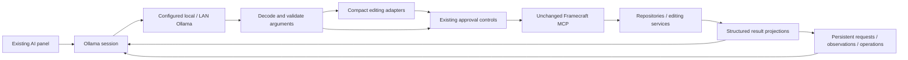

# Ollama pipeline audit and repair

The September 2026 session logs exposed integration defects beyond model quality. Eight successful visual inspections were followed by empty `save_video_cut` calls. The model's observations existed only in transient reasoning; previous images and that reasoning were then removed. Project/report JSON was also truncated, and the main editing schema was too large for direct use.

## Provider boundary

Codex retains its own session and instructions. These adapters do not change its MCP tool contracts.

## Findings and implementation

| Stage | Failure found | Repair |
| --- | --- | --- |
| Instructions | Small models received the full general editor prompt and a large catalog. | Dedicated Ollama instructions, short catalog, relevant schema selection. |
| Editing tools | `edit_project` combines many command variants; the flattened schema lost per-command requirements and was archived because of size. | Ten small, strict native operations translate to the same validated MCP transactions. Advanced tools remain accessible. |
| Arguments | Invalid calls reached approval; MCP `isError` responses escaped the repeated-failure guard. | Original JSON Schema validation before approval; shared failure counting for MCP errors and exceptions, reset only by success of that tool. |
| Tool history | Ollama templates can reject previous calls absent from the current schema list. | Stable dispatcher representation for inactive historical calls, preserving names, arguments and paired results. |
| Project/report results | Head/tail JSON excerpts hid IDs, tracks, source duration and coverage. | Structured projections with exact units, revisions, complete item summaries, counts and pointers to raw data. |
| Vision | Images were replaced before observations became durable. | Automatic batch commentary survives compaction; timestamp-validated per-frame notes are optional. Missing notes never block inspection or cut save/apply. The latest images retain their timestamp map across prose-only replies and compaction. |
| Memory | Chat compaction retained excerpts; a short continuation could replace the editing goal. | Persistent original requests, chronological visual-note index, report coverage and completed operations, with paged retrieval. Raw reasoning is excluded. |
| Generation | Unspecified thinking, no output bound, no deadline or runtime visibility. | Thinking off/low by default where supported, 4,096 output tokens, temperature 0.1, three-minute generation deadline, and no execution from truncated responses. |
| Runtime | Disk model size was the only indirect clue about GPU fit. | Context preset at 16,384 tokens; actual `/api/ps` allocation and response metrics in provider settings. |
| Persistence failure | An edit could succeed before local result processing failed. | Stop instead of asking the model to retry a completed mutation; retain an explicit outcome notice. |

Implementation lives in `server/services/ollama-*.ts`. The native operation adapter is `ollama-editor-tools.ts`, visual/task memory is `ollama-work-state.ts`, and generation transport is `ollama-client.ts`.

## Real model evidence

The optional [probe](../scripts/probe-ollama.ts) used the configured LAN Ollama server with `qwen3.5:9b`, thinking off and **16,384 context tokens**. It created an isolated project and synthetic media; it did not modify the user's open timeline.

| Task | Observed result |
| --- | --- |
| Add text, update its position/opacity, split it, read back the timeline | Passed in 27.5 seconds, including initial model loading. Three actual MCP edits; independent HTTP assertions checked both resulting clips. |
| Analyze a RED/GREEN source, inspect both frames, save observations, save a two-shot proposal | Passed in 32.5 seconds. Exact source ranges, evidence timestamps and color descriptions checked; proposal was not applied. |
| Tool failures | None in these two tasks. |
| Model allocation reported by Ollama | 6,165,354,249 bytes (about 5.74 GiB), all reported in GPU memory; zero reported outside GPU memory. This is model allocation, not total device usage. |
| Last-response generation rate | 88.5–89.6 tokens/second; this excludes tool execution and prompt evaluation. |

Build, 179 unit tests and four focused Ollama/Codex browser tests passed. The real probe is deliberately separate from routine automated tests and requires an explicitly configured Ollama URL/model.

## Remaining model limitations

Correct tool execution does not prove correct editorial judgment. A quantized local model can still misidentify gameplay events, miss brief actions between sampled frames, or choose weak cuts. Timestamp validation prevents invented evidence positions; it cannot prove that the model described the image correctly. Stored observations retain confidence and remain model claims.

A later read-only diagnostic using the user's longer rejected proposal exposed further limits: Qwen corrected a reversed interval but still emitted empty evidence arrays or unsupported timestamps during targeted repairs, even when supplied per-shot valid timestamp choices. The synthetic probe above therefore must not be treated as proof of reliable long-rush editing. The adapter now retains failed drafts, accepts repairs to individual shots, and distinguishes repeated identical errors from successive corrections; invalid proposals still cannot be saved.

Automatic Cuts should expose proposals for review. Complete overview coverage means all sampled overview frames were returned and annotated, not that every source frame was watched. Original source files remain available for closer inspection. The RED/GREEN probe validates basic perception and multi-step tool use, not arbitrary long-rush editing quality.

See [configuration, recovery and reproduction instructions](ollama.md). Runtime API definitions: [Ollama chat](https://docs.ollama.com/api/chat) and [running model allocation](https://docs.ollama.com/api/ps).
